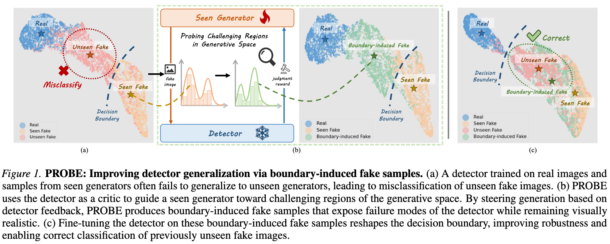
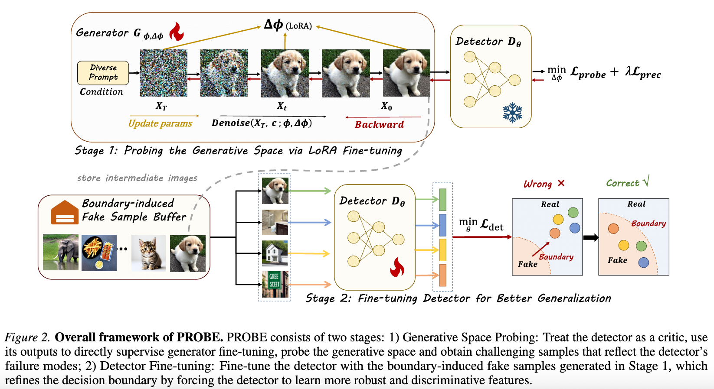
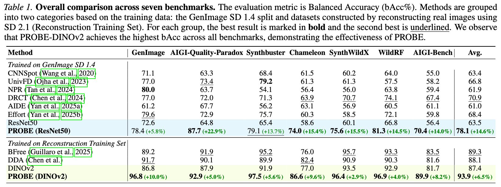

# PROBE: Probing Robustness via Boundary Exploration

This repository contains the codes for the paper:

**"Where Detectors Fail: Probing Generative Space for Generalizable AI-Generated Image Detection"**

*Zijie Cao, Weijie Tu, Yao Xiao, Weijian Deng, Weiyan Chen, Liang Lin, Pengxu Wei*

Accepted by **ICML 2026** 


## Abstract
Detecting AI-generated images (AIGI) remains challenging because detectors often fail to generalize to unseen generators. Although existing methods are trained on large datasets, their performance still degrades when generation settings change, indicating that data scale alone is insufficient and that limited coverage of generative variations during training is a key factor.
Studies on generative model editing show that small changes in internal representations can produce diverse and meaningful image variations, many of which are not explored under standard sampling.
Leveraging this insight, we propose PROBE (Probing Robustness via Boundary Exploration), a framework that improves detector generalization by actively exploring challenging regions of the generative process. Instead of treating the generator as a fixed data source, PROBE uses the detector as a critic to steer the generator through manifold-level modifications, producing realistic samples that are difficult to classify. 
These samples expose failure cases that are uncommon under standard data sampling strategies and are used to refine the detector.
Experimental results across multiple benchmarks indicate that PROBE enhances generalization to unseen generators, resulting in more generalizable AIGI detection performance.

## Intuition


## Framework


## Main Experiments



## TODO

- [x] Release evaluation codes and model weights.
- [ ] Release detector fine-tuning codes.
- [ ] Release boundary exploration codes.


## Get Started
### Evaluation
tips: For real image directories, the path **must** contain the string `real`; for generated image directories, the path **must not** contain the string `real`.
**RPOBE-ResNet50**
```bash
python ./PROBE-AIGI-Detection/Detector/evaluate_resnet.py \
    --root_list /path/to/real_images /path/to/fake_images \
    --ckpt /path/to/checkpoint.pth \
    --batch_size 8 \
    --crop_size 224 \
    --output_path ./results.txt
```

**RPOBE-DINOv2**
```bash
python ./PROBE-AIGI-Detection/Detector/evaluate_dino.py \
    --root_list /path/to/real_images /path/to/fake_images \
    --ckpt /path/to/checkpoint.pth \
    --batch_size 8 \
    --crop_size 336 \
    --output_path ./results.txt
```

## Model Weights

We release the following detector checkpoints fine-tuned with PROBE:

| Model | Backbone | Training Data | Avg. bAcc (7 benchmarks) |
|-------|----------|---------------|--------------------------|
| PROBE-ResNet50 | ResNet-50 | GenImage SD 1.4 + PROBE samples | 78.1% |
| PROBE-DINOv2 | DINOv2 | Reconstruction Training Set + PROBE samples | 93.9% |

You can find checkpoints in [https://modelscope.cn/models/shuinishaojiu/PROBE-AIGI-Detection](https://modelscope.cn/models/shuinishaojiu/PROBE-AIGI-Detection).


## Evaluation Benchmarks

The models are evaluated on seven benchmarks covering both in-house and in-the-wild scenarios. We are grateful to these authors for making this valuable data available as open source.

| Benchmark | Paper | Link |
|---------|-------|------|
| **GenImage** | *GenImage: A Million-Scale Benchmark for Detecting AI-Generated Images* | [Download](https://drive.google.com/drive/folders/1jGt10bwTbhEZuGXLyvrCuxOI0cBqQ1FS) |
| **Synthbuster** | *Synthbuster: Towards Detection of Diffusion Model Generated Images* | [Download](https://www.veraai.eu/posts/dataset-synthbuster-towards-detection-of-diffusion-model-generated-images) |
| **AIGI-Quality-Paradox** | *AIGI-Quality-Paradox* | [Download](https://github.com/Coxy7/AIGI-Detection-Quality-Paradox) |
| **Chameleon** | *A Sanity Check for AI-generated Image Detection* | [Download](https://github.com/shilinyan99/AIDE) |
| **SynthWildX** | *Raising the Bar of AI-generated Image Detection with CLIP* | [Download](https://github.com/grip-unina/ClipBased-SyntheticImageDetection/tree/main/data/synthwildx) |
| **WildRF** | *Real-Time Deepfake Detection in the Real-World* | [Download](https://drive.google.com/file/d/1A0xoL44Yg68ixd-FuIJn2VC4vdZ6M2gn/view) |
| **AIGI-Bench** | *Is Artificial Intelligence Generated Image Detection a Solved Problem?* | [Download](https://github.com/HorizonTEL/AIGIBench) |

